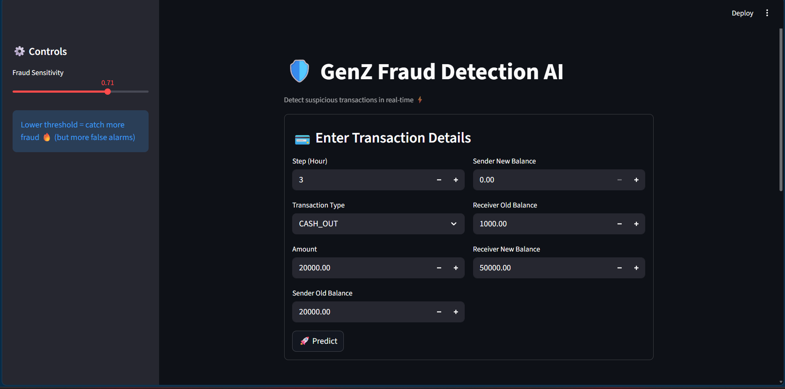
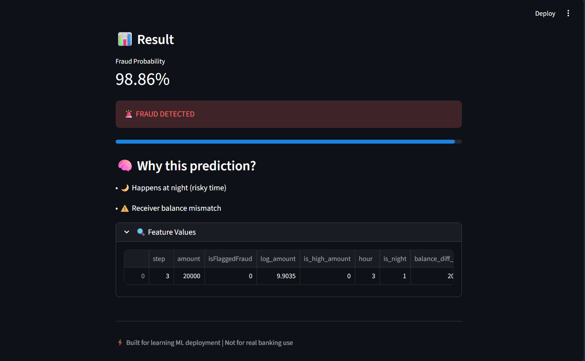

# 🛡️ Fraud Detection System (ML + Streamlit)

## 🚀 Overview
This project is an end-to-end Fraud Detection System built using Machine Learning and deployed with Streamlit.

It predicts whether a financial transaction is fraudulent or legitimate based on transaction behavior.

The system focuses on high recall to ensure maximum fraud detection and includes explainable predictions.

---

## 🔗 Live Demo
👉 [Click here to try the app](https://fraudshield-ai-nhbwcsqxrfvijywymo2bqg.streamlit.app/)

---

## 📸 App Screenshots

### 🔹 Input Interface

### 🔹 Prediction Result

---

## 🎯 Key Features
- Real-time fraud detection
- High recall model (prioritizes catching fraud)
- Feature engineering based on transaction behavior
- Adjustable threshold (recall vs precision)
- Explainable predictions (why flagged)
- Interactive Streamlit UI

---

## 🧾 Dataset
- PaySim synthetic financial transaction dataset
- Includes transaction type, amount, balances, and time

---

## ⚙️ Feature Engineering
- log_amount → handles skewness
- is_high_amount → flags top 1% transactions
- hour, is_night → time-based features
- balance_diff_orig → sender balance change
- balance_diff_dest → receiver balance change

These features help detect anomalies and fraud patterns.

---

## 🤖 Models Used
- Logistic Regression (baseline)
- Random Forest
- XGBoost (best performing)

---

## 📊 Model Performance

Model                  ROC-AUC    PR-AUC    Recall
--------------------------------------------------
Logistic Regression    0.97       0.55      0.89
Random Forest          0.997      0.84      0.96
XGBoost                0.998      0.87      0.96

Final Model: XGBoost

---

## 🎯 Evaluation Strategy
- Focus on Recall (important for fraud detection)
- PR-AUC for imbalanced data
- Threshold tuning (not default 0.5)

---

## 🖥️ Streamlit App Features
- Transaction input form
- Fraud probability output
- Threshold adjustment slider
- Visual explanation of prediction

---

## ▶️ How to Run

# Clone repo
git clone https://github.com/your-username/fraud-detection.git

# Go to project folder
cd fraud-detection

# Install dependencies
pip install -r requirements.txt

# Run app
streamlit run app_fraud.py

---

## 📦 Requirements

streamlit  
scikit-learn  
xgboost  
pandas  
numpy  
joblib  

---

## 🧠 Key Learnings
- Handling imbalanced datasets
- Importance of recall in fraud detection
- Feature engineering for anomaly detection
- Model evaluation using PR-AUC
- ML deployment using Streamlit

---

## ⚠️ Disclaimer
This project is for educational purposes only.

---

## 👨‍💻 Author
Yash Raj

---

## ⭐ If you like this project
Give it a star on GitHub!
